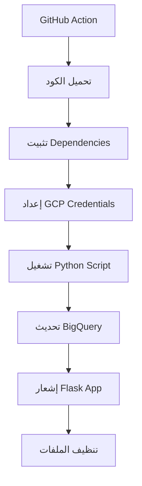

# تحديث المخزون التلقائي عبر GitHub 🚀

## خطوات الإعداد

### 📋 1. إعداد GitHub Secrets (مطلوب)

انتقل إلى repository الخاص بك على GitHub:
```
GitHub Repository → Settings → Secrets and variables → Actions → New repository secret
```

أضف هذه الـ 3 secrets:

#### أ) GCP_SERVICE_ACCOUNT_KEY
```
اسم السر: GCP_SERVICE_ACCOUNT_KEY
القيمة: محتوى ملف JSON الخاص بـ Google Cloud Service Account
```
**كيفية الحصول عليه:**
1. انتقل إلى Google Cloud Console
2. IAM & Admin → Service Accounts  
3. اختر service account الخاص بك
4. Keys → Add Key → Create new key → JSON
5. انسخ كامل محتوى الملف والصقه في Secret

#### ب) STOCK_UPDATE_TOKEN  
```
اسم السر: STOCK_UPDATE_TOKEN
القيمة: أي كلمة مرور قوية (مثل: StockUpdate2024@MySecret)
```

#### ج) APP_WEBHOOK_URL
```
اسم السر: APP_WEBHOOK_URL  
القيمة: رابط تطبيقك (مثل: https://yourdomain.com أو http://yourserver:5000)
```

### 🖥️ 2. إعداد متغير البيئة في الخادم

في خادم التطبيق، أضف:
```bash
export STOCK_UPDATE_TOKEN=StockUpdate2024@MySecret
# أو في ملف .env:
echo "STOCK_UPDATE_TOKEN=StockUpdate2024@MySecret" >> .env
```

### 🎯 3. كيفية الاستخدام

#### أ) التشغيل اليدوي من GitHub:
1. انتقل إلى repository على GitHub
2. اضغط على tab "Actions"  
3. اختر "Stock Data Update"
4. اضغط "Run workflow"
5. اختر السكريپت المطلوب:
   - `inventory.py` - التحديث الأساسي
   - `historical_inv.py` - البيانات التاريخية
   - `inventory_history.py` - تاريخ المخزون

#### ب) التشغيل من واجهة التطبيق:
- اضغط زر التحديث 🔄 في لوحة المعلومات

#### ج) التشغيل التلقائي:
- كل يوم الساعة 2 صباحاً (UTC)
- عند دفع تغييرات في مجلد `data-push/`

### 🔍 4. مراقبة العملية

#### من GitHub:
- Actions → اختر run → راجع الـ logs

#### من التطبيق:
- رسائل تفاعلية في الواجهة
- Console logs في الخادم

### ⚠️ 5. استكشاف الأخطاء

#### إذا فشل GitHub Action:
```bash
# تحقق من وجود الملفات
ls data-push/
# يجب أن ترى: inventory.py, historical_inv.py, inventory_history.py
```

#### إذا ظهر "Unauthorized":
- تأكد من تطابق `STOCK_UPDATE_TOKEN` في GitHub Secrets والخادم

#### إذا فشل في الاتصال بـ BigQuery:
- تحقق من صحة `GCP_SERVICE_ACCOUNT_KEY`
- تأكد من permissions الـ service account

### 🧪 6. اختبار النظام

#### اختبار GitHub Action:
```bash
# من GitHub Actions → Run workflow يدوياً
```

#### اختبار API محلياً:
```bash
curl -X POST http://localhost:5000/api/trigger-stock-update \
  -H "Authorization: Bearer StockUpdate2024@MySecret" \
  -H "Content-Type: application/json" \
  -d '{"source": "test"}'
```

### 📊 7. مميزات النظام

✅ **تشغيل متعدد**: 3 سكريپتات مختلفة  
✅ **أمان عالي**: Token authentication  
✅ **مرونة**: تشغيل يدوي أو تلقائي  
✅ **مراقبة**: Logs مفصلة  
✅ **استقرار**: Error handling و timeouts  
✅ **تنظيف**: Auto cleanup للملفات المؤقتة  

### 🔄 8. سير العمل



### 🆘 الدعم

إذا واجهت مشاكل:
1. راجع GitHub Actions logs
2. تحقق من Flask app logs  
3. تأكد من صحة جميع الـ Secrets
4. تحقق من permissions الـ service account

---
**ملاحظة**: تأكد من عدم مشاركة الـ tokens أو credentials مع أي شخص!
